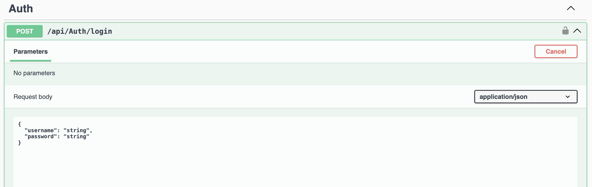
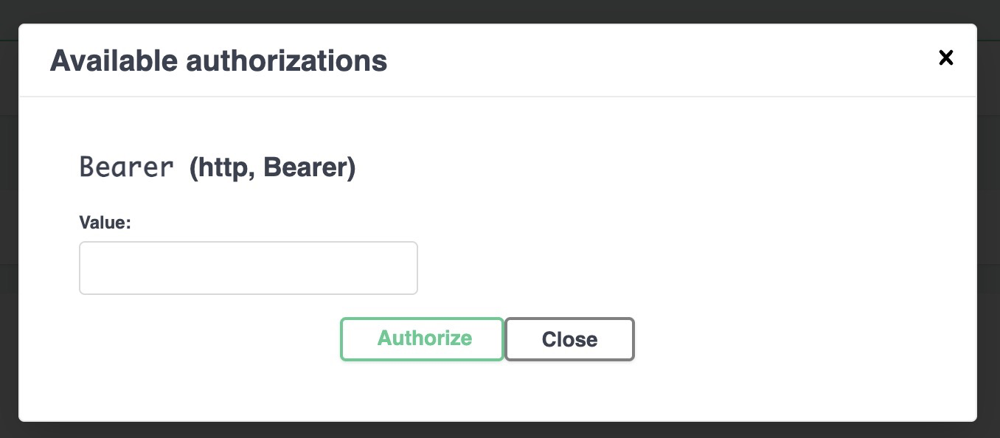

# PopsicleFactory API Suite

Welcome to **PopsicleFactory**, a modular and extensible RESTful Web API solution designed to manage the inventory of Popsicle Co. The goal is to expose a set of secure, scalable, and maintainable REST APIs that allow full CRUD operations on popsicle inventory.

---

## Solution Structure & Purpose

### 1. **PopsicleFactory.AuthApi**
> *Authentication Service*

- A dedicated Web API project responsible for authenticating users and issuing JWT tokens.
- **Purpose of separation**: Allows for future enhancements like SSO, multi-factor authentication, and role-based access without impacting core API services.

- Please refer below users to generate a jwt token. **Endpoint: Auth api: api/Auth/login**
- Enter the received token into Authorize dialog to access popsicle api's.

| Username         | Password     | Role    |
| ---------------- | ------------ | ------- |
| `ryan@demo.com`  | `Ryan@12345` | `Admin` |
| `katie@demo.com` | `Katie@12345`| `Admin` |
| `bob@demo.com`   | `Bob@12345`  | `User`  |
| `maria@demo.com` | `Maria@12345`| `User`  |

---

### 2. **PopsicleFactory.WebApi**
> *Core Inventory CRUD API*

- Exposes secure endpoints for managing the popsicle inventory (Create, Read, Update, Delete).
- Protected using JWT tokens (issued by `AuthApi`).
- Designed with RESTful principles to support multiple clients.

---

### 3. **PopsicleFactory.DataProvider**
> *Data Access Layer*

- Handles all database interactions using repository and EF Core patterns. (Implemented using InMemory DB)
- **Purpose of separation**: Enables switching database providers (e.g., SQL Server → PostgreSQL) with minimal code change.

---

### 4. **PopsicleFactory.Infrastructure**
> *Cross-Cutting Concerns*

- Manages global exception handling, custom middlewares, and may extend further for shared security policies.
- **Purpose of separation**: Promotes clean architecture by decoupling infrastructure logic from business logic.
- Targeted to be used across services as a shared NuGet package.

---

### 5. **PopsicleFactory.UnitTest**
> *Automated Tests*

- Contains unit tests to validate API endpoints and services behavior.
- Built using **xUnit**, with mocking for service & repository dependencies.
- Ensures correctness, regressions, and maintainability.

---

### Run the Project

# Navigate to PopsicleFactory.AuthApi
dotnet run --project PopsicleFactory.AuthApi

# In another terminal, run the main Web API
dotnet run --project PopsicleFactory.WebApi
